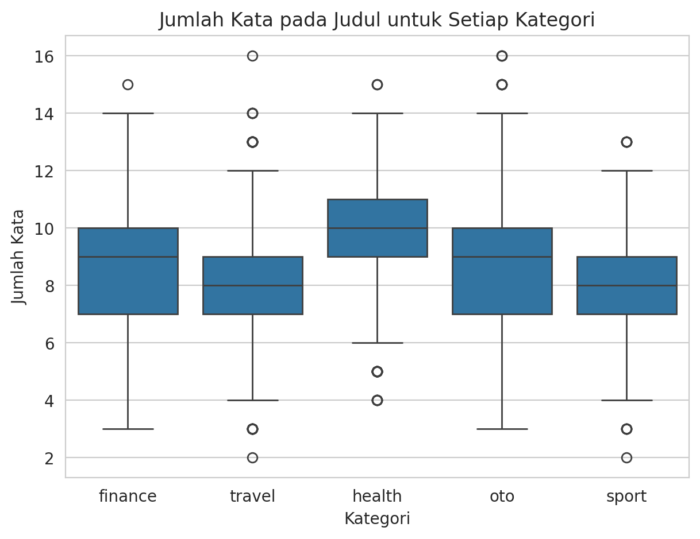
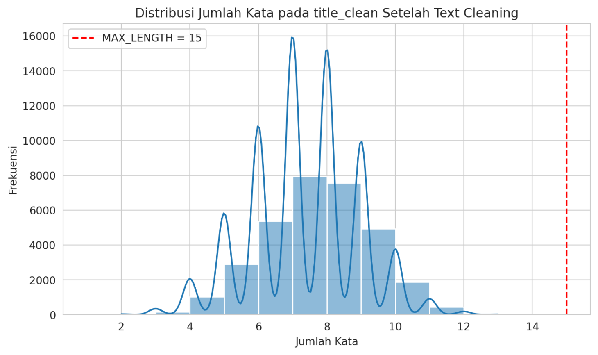
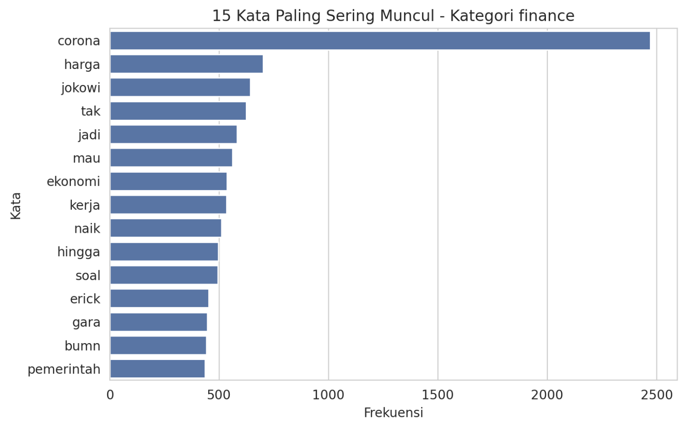
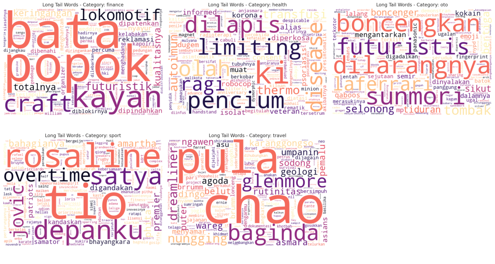
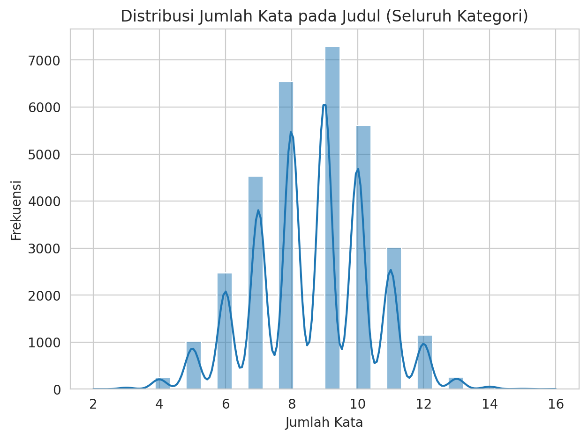
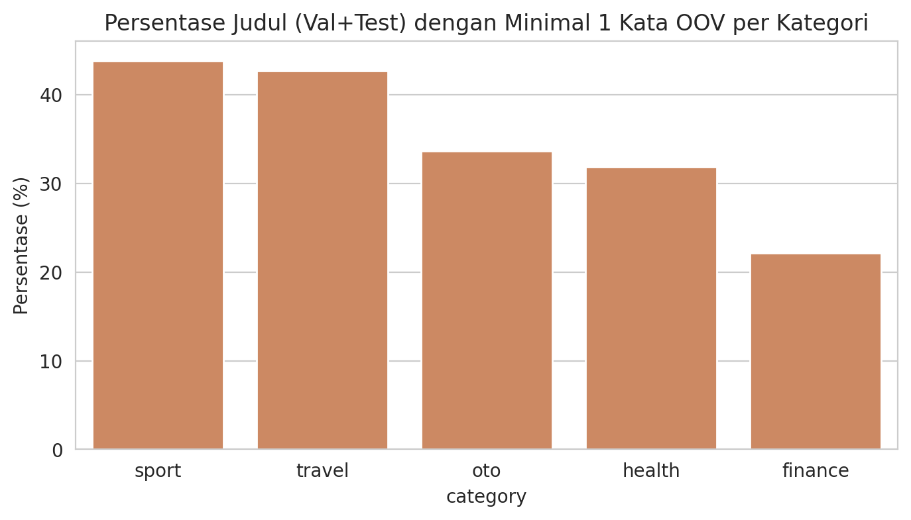
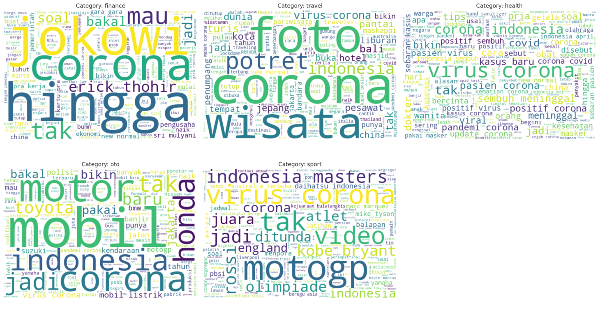

# 📰 Automatic Indonesian News Classification

An end to end NLP pipeline that classifies Indonesian news headlines from detik.com into five categories (**finance, health, oto, sport, travel**) using a TensorFlow/Keras ensemble, deployed as an interactive Streamlit app so an editorial team can get a category suggestion the moment a headline is typed.

🚀 **Live demo:** https://indonesian-news-classification.streamlit.app/


---

## 📑 Table of Contents
- [📰 Business Context](#-business-context)
- [🗃️ Dataset](#️-dataset)
- [🔬 Methodology](#-methodology)
- [📈 Results](#-results)
- [🗂️ Repository Structure](#️-repository-structure)
- [💻 Running Locally](#-running-locally)
- [🛠️ Tech Stack](#️-tech-stack)
- [⚠️ Limitations & Next Steps](#️-limitations--next-steps)
- [👤 Author](#-author)

---

## 📰 Business Context

In a digital newsroom, tagging a fresh article into the right category (finance, sport, travel, and so on) is still mostly a manual call made by the editor the moment the headline is written. Under the pressure of publishing fast, that manual step is slow, and two editors can easily tag near identical headlines into different categories depending on how each one reads it.

This project tackles that with a neural network that predicts a headline's category from the text alone, right after a journalist or editor types it in. The goal is not to replace the editor, it is to give them a fast, consistent first suggestion they only need to confirm or correct, instead of deciding from a blank slate every time.

**Target users:** editorial and content management teams at digital news portals, specifically the editors responsible for tagging articles before publication.

## 🗃️ Dataset

- 91,017 headlines scraped from detik.com, spanning January to June 2020 (`date`, `url`, `title`, `category`).
- 126 exact duplicate titles were dropped first, since `title` is the only modeling feature and duplicate text across a train/val/test split would leak information between them.
- The raw data covers 9 categories. Per this project's scope, only 5 were kept (`finance`, `health`, `oto`, `sport`, `travel`); `hot`, `news`, `inet`, and `food` were dropped.
- After filtering, the modeling dataset has **32,318 headlines**, with a class imbalance of about **5.8x** between the largest and smallest class:

| Category | Count | Share |
|---|---:|---:|
| finance | 14,141 | 43.8% |
| travel | 6,454 | 20.0% |
| health | 4,914 | 15.2% |
| oto | 4,375 | 13.5% |
| sport | 2,434 | 7.5% |

**Category distribution:**



## 🔬 Methodology

The full analysis lives in [`notebooks/P2G7_Muhammad_Akbar_Suharbi.ipynb`](notebooks/P2G7_Muhammad_Akbar_Suharbi.ipynb), with model inference on unseen samples in a separate notebook, [`notebooks/P2G7_Muhammad_Akbar_Suharbi_inference.ipynb`](notebooks/P2G7_Muhammad_Akbar_Suharbi_inference.ipynb), as required by the project's rubric.

1. **🔍 EDA before feature engineering**, covering category distribution, headline length per category, word frequency, word clouds, bigram/trigram patterns, and a volume-over-time trend. One key finding: the word "corona" dominates the vocabulary of almost every category, since the scraping window lines up with the start of the COVID-19 pandemic in Indonesia.

   | Headline length by category | Most frequent words, finance |
   |---|---|
   |  |  |

   

2. **⚙️ Feature Engineering** — text cleaning (lowercasing, non-alphabet removal, Indonesian stopword removal via Sastrawi), a stratified 70/15/15 train/validation/test split, label encoding plus one hot targets, a Keras `Tokenizer` with `VOCAB_SIZE = 10000`, padding to `MAX_LENGTH = 15`, and `class_weight` to counter the 5.8x class imbalance. All seeding (`random`, `numpy`, `tensorflow`, `PYTHONHASHSEED`) is consolidated in a single cell at the top of the notebook so the whole pipeline is reproducible end to end.

   Re running the EDA after this step confirmed the split stayed stratified, that padding to 15 tokens truncates almost nothing, and surfaced which words fall into the long tail that the 10,000 word vocabulary does not cover:

   | Headline length after cleaning | OOV rate by category |
   |---|---|
   |  |  |

   

3. **🤖 ANN Training (benchmark)** — a Sequential API dense network (`Embedding(10000, 64)` → `GlobalAveragePooling1D` → `Dense(64)` → `Dropout(0.3)` → `Dense(5, softmax)`, 644,485 parameters, trained from scratch with no pretrained embedding). Three tuning runs varied batch size and learning rate; the strongest configuration (learning rate 0.0005) was evaluated on the untouched test set and set the benchmark the improvement stage had to beat.

4. **🚀 ANN Improvement** — a Functional API TextCNN (`Embedding` → `SpatialDropout1D(0.2)` → three parallel `Conv1D` branches with kernel sizes 2, 3, and 4 to capture bigram/trigram/four-gram patterns → `GlobalMaxPooling1D` per branch → `Concatenate` → `Dense(64)` → `Dropout` → `Dense(5, softmax)`), directly motivated by the bigram/trigram findings from EDA. Three hyperparameter variants were trained, then combined with a fourth model built on the same TextCNN architecture but with its embedding layer initialized from a **Word2Vec** model (skip-gram, `vector_size=64`, trained only on the training split to avoid leakage). The four models are combined through **soft voting**, averaging their predicted probabilities.
5. **✅ Evaluation** — classification report, confusion matrix, and per-category error analysis on the held out test set for both stages, to see not just whether the model works but where it still gets confused.
6. **📦 Deployment** — the four ensemble members, tokenizer, and label encoder are serialized and served through a three page Streamlit app (`app.py`, `eda.py`, `prediction.py`), with an EDA page (before/after feature engineering, cached with `st.cache_data`) and a Prediction page supporting single and batch input, an adjustable confidence threshold, CSV export, and a manual review flag for low confidence predictions.

## 📈 Results

The **4 model soft voting ensemble** (three TextCNN variants plus one TextCNN with Word2Vec pretrained embedding) was selected as the final model, since the project rubric requires the best model to come from the ANN Improvement stage, not ANN Training.

| Stage | Model | F1 Macro (Test) | Accuracy (Test) |
|---|---|---:|---:|
| ANN Training (benchmark) | Dense Network, best tuning | 0.8896 | 0.8981 |
| ANN Improvement (final) | Ensemble of 4 TextCNN variants | **0.8929** | **0.8989** |
| **Gain** | | **+0.0033** | **+0.0008** |

Per category performance of the final ensemble on the test set:

| Category | Precision | Recall | F1 Score |
|---|---:|---:|---:|
| finance | 0.9621 | 0.8855 | 0.9222 |
| health | 0.8616 | 0.9294 | 0.8943 |
| oto | 0.8814 | 0.8720 | 0.8766 |
| sport | 0.8628 | 0.9479 | 0.9034 |
| travel | 0.8343 | 0.9050 | 0.8682 |

A few things worth calling out:

- Neither a single TextCNN variant (best: F1 macro 0.8812) nor averaging just the three TextCNN variants (F1 macro 0.8890) beat the Dense Network benchmark on their own. The win only appeared once the Word2Vec pretrained model joined as a fourth, differently initialized member, its errors did not fully overlap with the other three, so averaging the four compensated for each other's mistakes.
- `finance` and `travel` remain the most confused pair across every model and every stage, which lines up with the EDA finding that travel/tourism headlines are often framed in economic terms, so their vocabulary genuinely overlaps with finance.
- `sport`, the smallest class at 7.5% of the data, still gets the second highest recall (0.9479) thanks to `class_weight`, confirming that strategy did its job of protecting minority class performance.
- The margin between the two stages is intentionally thin. The EDA showed these five categories already have fairly distinct vocabulary, so a simple Dense Network can already capture most of the classification signal from word occurrence alone; TextCNN's edge in modeling word order only pays off once you also give it a second, differently sourced embedding to vote alongside.

## 🗂️ Repository Structure

```
indonesian-news-classification/
├── data/
│   └── detik_news_title.csv
├── docs/
│   └── *.png                                # EDA visuals and app banner used in this README
├── models/
│   ├── model_2_baseline.keras
│   ├── model_2b_numfilters128.keras
│   ├── model_2c_dropout03.keras
│   ├── model_3_word2vec.keras
│   ├── tokenizer.pkl
│   └── label_encoder.pkl
├── notebooks/
│   ├── P2G7_Muhammad_Akbar_Suharbi.ipynb            # EDA -> feature engineering -> training -> evaluation
│   └── P2G7_Muhammad_Akbar_Suharbi_inference.ipynb  # Inference on unseen headlines, separate notebook per rubric
├── src/
│   ├── app.py            # Entry point / page router
│   ├── eda.py             # EDA page (before and after feature engineering)
│   ├── prediction.py      # Prediction page (single + batch, confidence threshold)
│   └── image_news.png     # Banner used inside the EDA page
├── requirements.txt
├── README.md
└── .gitignore
```

> **Note on this layout.** This structure is meant for the public/portfolio copy of the project. If this same codebase is still sitting inside a GitHub Classroom submission that has not been graded yet, keep that repository in the flat `deployment/` folder layout the assignment brief asks for (`deployment/app.py`, `deployment/eda.py`, `deployment/prediction.py`, `deployment/requirements.txt`, notebooks and `url.txt` at the repository root). Renaming that folder away from `deployment/` before grading is finished risks being marked as if the deployment folder is missing. Once grading is done, feel free to reshape that repo the same way, or keep this tidier layout only in a separate public copy.

## 💻 Running Locally

```bash
git clone https://github.com/akbarabie/indonesian-news-classification.git
cd indonesian-news-classification

python -m venv .venv
source .venv/bin/activate        # Windows: .venv\Scripts\activate

pip install -r requirements.txt

streamlit run src/app.py
```

The app will be available at `http://localhost:8501`.

If you deploy this on Streamlit Community Cloud, set the **Main file path** to `src/app.py` and keep the working directory at the repository root, the app reads `data/detik_news_title.csv` and everything under `models/` using paths relative to the repo root, not to the `src/` folder.

## 🛠️ Tech Stack

**Modeling:** Python, TensorFlow/Keras (Sequential and Functional API), gensim (Word2Vec), scikit-learn, Sastrawi
**Visualization:** Matplotlib, Seaborn, WordCloud
**Deployment:** Streamlit, Streamlit Community Cloud

## ⚠️ Limitations & Next Steps

- **Confusion between finance, travel, and oto is a language limitation, not an architecture one.** It shows up consistently across every model in this project, including the final ensemble, most likely because Indonesian headlines about tourism or the automotive industry genuinely borrow economic vocabulary. A better architecture alone is unlikely to fully resolve this.
- **The Word2Vec embedding was trained only on this project's own corpus**, which is entirely from January to June 2020, the start of the pandemic in Indonesia. Its word representations likely carry a pandemic era bias and may not generalize as well to headlines from a very different period or news cycle.
- **The final model is an ensemble of 4 separate networks, not one.** Every prediction needs 4 forward passes, which means more compute and latency per request than a single model design, worth revisiting if this ever needs to run at high traffic in production.
- **Only tested on short headlines (about 8 to 10 words on average).** It is untested on longer text such as full article bodies.

Planned improvements:
- Extend the dataset beyond the pandemic window so the vocabulary is not so dominated by one event.
- Explore contextual embeddings such as IndoBERT, which represent a word differently depending on its sentence context, unlike Word2Vec, and may help specifically with the finance/travel confusion.
- Try data augmentation (back translation or synonym replacement) targeted at `sport`, the smallest class, instead of relying on `class_weight` alone.
- Knowledge distillation from the 4 model ensemble into a single lighter model, to cut inference cost without giving up much accuracy.
- Move from manual hyperparameter search to a systematic tuner such as KerasTuner or Optuna.
- Add performance monitoring after deployment, since news vocabulary drifts over time and a category that is easy to classify today may not stay that way.

## 👤 Author

**Muhammad Akbar Suharbi**
Data Analyst | Data Scientist | Data Engineer
[LinkedIn](https://www.linkedin.com/in/muhammad-akbar-suharbi-6955ba189/) · [GitHub](https://github.com/akbarabie)
